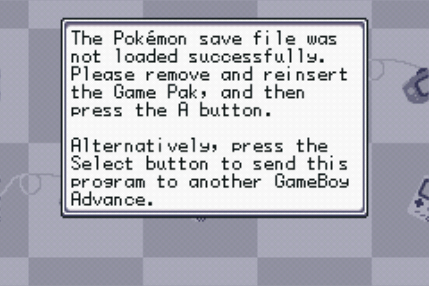
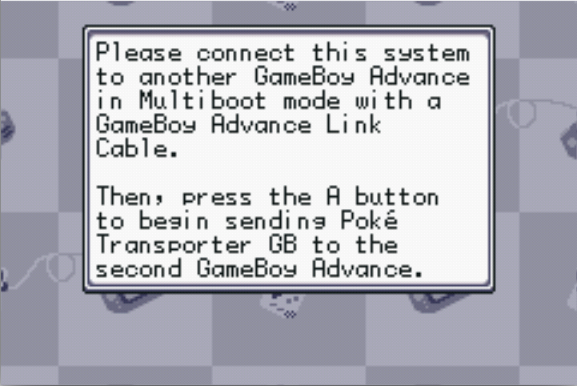
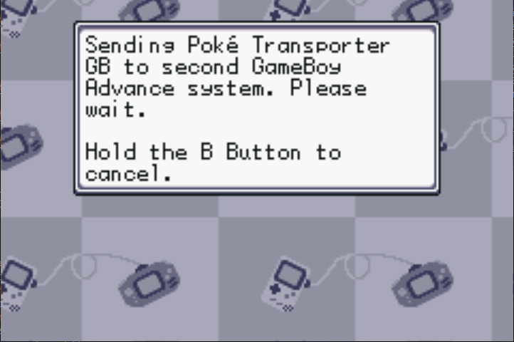

## Intro

The EZ Flash Omega Definitive Edition flashcart is the definitive GBA flashcart for Pokémon fans, because it supports DS Link and works with the Gamecube games.

And we're pleased to report that it will also work as a _target_ with Poke Transporter GB when storing the pokémon game in NOR Flash (Mode B/Single cart mode). In fact, this flashcart is the only one that can be used to transfer pokémon _towards_. Other flashcarts can only be used to _launch_ Poke Transporter GB.

_However_, there is a **hardware quirk** that makes using Poke Transporter GB with mode B a bit more involved compared to original pokémon cartridges: If you launch Poke Transporter GB and **then** insert the EZ Flash Omega DE into the cartridge slot, the GBA will simply reboot. This doesn't happen when inserting original cartridges.

So, to circumvent that problem, you need to start Poke Transporter GB with multiboot _while_ the EZ Flashcart is already inserted. This document will guide you through that process.

## Usage

As stated in the intro, when using the EZ Flash Omega DE as a target to transfer pokémon towards, we need to start the gba in multiboot mode with the EZ Flash Omega DE already inserted. 

There are 2 methods to do this, depending on whether you ALSO want to launch Poke Transporter GB from the EZ Flash Omega DE:

### Method 1: Wii/Gamecube

Requirements: 
- EZ Flash Omega Definitive Edition (obviously)
- Modded Wii/modded Gamecube
- 1 GBA
- 1 GBC OR GBA
- Gamecube-to-GBA cable
- Gameboy color link cable (needed by Poke Transporter GB anyway)

Steps:

- Make sure the pokémon game is stored on your EZ Flash' NOR flash.
- Flip the physical switch to mode B on the cartridge and verify that the game launches directly when powering on the GBA with the flashcart inserted.
- With the EZ Flash Omega DE inserted, power on the GBA and hold SELECT+START. The gameboy logo will remain on screen.
- Now connect the Gamecube-to-GBA cable.
- Launch a program like FIX94's [GBA Link Cable ROM Sender](https://github.com/FIX94/gba-link-cable-rom-sender) on the GameCube or Wii to upload Poke_Transporter_GB_mb.gba to the GBA.
- When the upload starts, you'll hear a sound coming from the GBA and you'll see the Nintendo logo appear beneath the Gameboy logo.
- When the upload is finished, Poke Transporter GB should be launched automatically and if you followed these instructions correctly, it should be able to interact with the gen III game stored on the EZ Flash Omega DE.

### Method 2: 2 GBAs

Requirements:
- EZ Flash Omega Definitive Edition (obviously)
- 2 GBAs
- Gameboy Advance link cable
- Gameboy Color link cable

Steps:
- Make sure the loader.gba is stored on the microSD card of the EZ Flash Omega DE
- Make sure the pokémon game is stored on your EZ Flash' NOR flash.
- Make sure the physical switch on the EZ Flash is set to mode A (the menu should show)
- Insert the EZ Flash in GBA 1 and launch loader.gba.
- Press START on the splash screen. This popup should show:

- Press SELECT. This popup should show:

- Now pull the EZ Flash Omega DE from GBA 1 while it's still powered on.
- Flip the physical switch on the EZ Flash to mode B
- Insert the EZ Flash Omega DE into GBA 2.
- Connect the GBA link cable to both GBAs. (narrow plug on GBA 1, wide plug on GBA 2)
- Power on GBA 2 and hold SELECT+START. The gameboy logo should stay on the screen.
- Now press A on GBA 1. It should show this popup:

- On GBA 2, you should hear a sound and the Nintendo logo should show up under the Gameboy logo while the upload is being done.
- Once the upload is done, Poke Transporter GB should now be shown on GBA 2 and should be fully functional.
- Power off GBA 1 and disconnect the GBA link cable.
- You can now connect the gameboy color link cable between gba 1 and 2 and insert the gen I or gen II cartridge in GBA 1 and follow the main instructions to start the transfer process.

